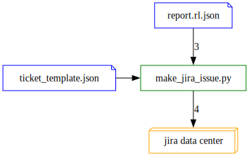

# rl-scanner-to-jira

ReversingLabs provides the official integration with Atlassian Jira to automatically create tickets in a Jira project based on security issues detected in your software during [Spectra Assure](#what-is-spectra-assure) analysis.

**Important: This integration is compatible only with self-managed Jira deployments (Jira Data Center).**

The integration is provided in this repository as a Python script called `make_jira_issue.py`.
It takes a Spectra Assure [rl-json](#what-is-rl-json) report as the input and automatically creates Jira tickets based on detected issues (policy violations) from the report.
Specifically, items in the `report.metadata.violations` object in the report are transformed into tickets.

You can specify the criteria for creating Jira tickets in a [template file](#template).
The default (minimal) template file is called `jira_issue_template.json` and provided in this repository.

This integration is most suitable for users who already rely on Atlassian Jira for issue prioritization and remediation, and want to automate and speed up that process.


### What is Spectra Assure?

The Spectra Assure platform is a set of ReversingLabs products primarily designed for software assurance and software supply chain security use-cases.

It helps users protect their software supply chains by analyzing compiled software packages, their components and third-party dependencies to detect exposures, reduce vulnerabilities, and eliminate threats before reaching production.

Users can choose to work with Spectra Assure as [a CLI tool](https://docs.secure.software/cli/), a [hosted SaaS solution](https://docs.secure.software/portal/) and [an API](https://docs.secure.software/api/), or use Spectra Assure Docker images and CI/CD integrations.


### What is rl-json?

Analysis reports are the primary output of the Spectra Assure software scanning process.
All Spectra Assure products support multiple report formats that accommodate a wide range of user needs.

`rl-json` is one of those report formats.
It is a proprietary ReversingLabs report format most suitable for integration workflows, or for users who want to parse the report data as a JSON file with their own tools.

To learn more about the `rl-json` report and understand its structure, you can read the full report schema in the [official documentation](https://docs.secure.software/cli/rl-json-schema).


## How this integration works



 1. A software build process produces a file to scan (build artifact).
 1. The file is scanned with a Spectra Assure product and a report is produced in the `rl-json` format.
 1. Using the ticket template, the Python script `make_jira_issue.py` creates a Jira ticket in the specified Jira project.


## Requirements and dependencies

- Python (the script is tested with 3.10, 3.11, 3.12)
- [requests](https://pypi.org/project/requests/)
- [jira](https://pypi.org/project/jira/)

- A valid and active [Jira token](https://confluence.atlassian.com/enterprise/using-personal-access-tokens-1026032365.html) to allow connecting the integration to your Jira instance. It's highly recommended to consult your Jira administrator for assistance with obtaining the token, as well as for guidance and any specific limitations regarding token use in your organization.

- A valid and active Spectra Assure license. This is required so that you can use the licensed Spectra Assure product to create `rl-json` reports. Consult the official documentation for your product - [CLI](https://docs.secure.software/cli/licensing-guide) or [Portal](https://docs.secure.software/portal/settings#analysis-capacity) - for instructions about licenses.


## How to use this integration

1 - Run a process that produces a file to scan. This is typically an automated action that happens as part of your CI/CD workflow and produces one or more build artifacts (software packages).

2 - Scan the file produced by your process with a Spectra Assure product and generate an `rl-json` analysis report.

| Product | Instructions |
| :--------- | :------------- |
| **Spectra Assure CLI** | Use the [rl-secure report](https://docs.secure.software/cli/commands/report) command. Example: `rl-secure report rl-json pkg:rl/my-project/my-package@1.0.1` |
| **Spectra Assure Portal** | This report format cannot be downloaded from the Portal interface. |
| **Spectra Assure Portal API** | Send a GET request to the [Export analysis report](https://docs.secure.software/api-reference/#tag/Version/operation/getVersionReport) endpoint. Set `rl-json` as the *report_type* path parameter in your request. |
| **Spectra Assure integrations** | Specify `rl-json` or `all` as the report format with the `--report-format` parameter. The exact procedure depends on the integration you're using, so it's best to consult the documentation for that specific integration. |

3 - Use the `make_jira_issue.py` Python script to create Jira tickets for security issues (policy violations) from the `rl-json` report. For the integration to work, you must specify: the URL of your Jira server; your Jira token; and the name of the Jira project where you want to create tickets. These configuration values can either be specified as environment variables or passed directly to the Python script. You must also specify the path to the `rl-json` report file.

Other, optional configuration values can be specified as needed.
You can find the complete list of supported parameters in the [Configuration section](#configuration).

The following example shows how to run the Python script:

```sh
python3 make_jira_issue.py \
    --jira-server='https://your-jira-server-fqdn' \
    --jira-project='TESTING' \
    --jira-issuetype='Task' \
    --rl-json-report='./report/report.rl.json' \
    --no-verify-cert \
    --issue-template-file='jira_issue_template.json'
```


### Configuration

The `make_jira_issue.py` script supports the following configuration parameters:


**Required**

- `rl-json-report` - String. Path to the JSON file containing the `rl-json` analysis report. The default value is `./report/report.rl.json`

- `jira-server` - String. URL of the Jira instance that the integration should access and work with. **Required only if not already specified via the environment variable** `MY_JIRA_SERVER`

- `jira-token` - String. Token to authenticate to the Jira instance specified in `jira-server`. **Required only if not already specified via the environment variable** `MY_JIRA_TOKEN`

- `jira-project` - String. Name of the Jira project that exists on the Jira instance specified in `jira-server`. This is the project in which the integration will create tickets. **Required only if not already specified via the environment variable** `MY_JIRA_PROJECT`


**Optional**

- `jira-issuetype`: String. Jira issue type that will be assigned to all tickets created by the integration. Default: `Task`

- `issue-template-file`: String. Path to a Jira ticket template file that specifies mandatory fields for all tickets created by the integration. The template must be a valid JSON file. Default: `jira_issue_template.json`

- `no-split-to-individual-violations`: Boolean. Create one ticket per analyzed file instead of creating one ticket for each violation detected in the analyzed file. This allows controlling the granularity/scope of tickets created by the integration. Disabled by default (implicitly set to `False`)

- `include-violations-pass`: Boolean. Create tickets for violations with `PASS` status instead of creating them only for `FAIL` status. This helps control the volume of tickets created by the integration. Disabled by default (implicitly set to `False`)

- `no-verify-cert`: Boolean. Do not verify the `https` certificate of the Jira server. Disabled by default (implicitly set to `False`)

- `force-new-ticket-on-duplicate`: Boolean. By default, the integration tries to detect issues in the specified `jira-project` with the same `summary` (title) and avoids creating new tickets if duplicate ones already exist. This option overrides the default behavior and enforces duplicate tickets. Disabled by default (implicitly set to `False`)

- `attach-file`: String. Path to a file that will be attached to each ticket created by the integration. Applies only to tickets created in the current script run (not a permanent setting).


**Debugging**

- `show-current-project-task-mandatory-fields`: Boolean. When this parameter is specified, the script outputs all mandatory fields for the configured `jira-project` and `jira-issuetype` and exits without processing any reports. This parameter is disabled by default (implicitly set to `False`) and mainly intended as support in building the [ticket template file](#template) to make sure all mandatory fields are covered.

**Example output with show-current-project-task-mandatory-fields**

```yaml
Task:
  Summary: Known
    name: Summary
    fieldId: summary
  Issue Type: Known
    name: Issue Type
    fieldId: issuetype
    allowedValues:
       Task
  Component/s: Unknown: This field must be added to the json template
    name: Component/s
    fieldId: components
    allowedValues:
       Default-component
  Reporter: Known
    name: Reporter
    fieldId: reporter
  Project: Known
    name: Project
    fieldId: project
    allowedValues:
       TESTING
```

When creating or modifying your ticket template file, the `fieldId` from this output should be the top-level key in the template JSON file:

```json
{
  "project": {
    "key": null
  },
  "summary": null,
  "description": null,
  "issuetype": {
    "name": "Task"
  },
  "components": [
    {
      "name": "Default-component"
    }
  ]
}
```


### Template

Jira installations differ significantly because of various local customizations and plugins.
In some cases, additional fields may be mandatory when creating a new issue.

To accommodate as many use-cases as possible, this integration only provides the minimal (default) ticket template.
You can create a custom JSON file to extend the default template and specify different mandatory fields for your tickets.
The custom template file is automatically merged with the minimal ticket template.

**Minimal Jira ticket template**

```json
{
  "project": {
    "key": null
  },
  "summary": null,
  "description": null,
  "issuetype": {
    "name": "Task"
  }
}
```

The minimal template creates tickets in a Jira project specified by `key`.
The tickets will only have the following 3 fields set:

 - `summary`: a textual string.
 - `description`: a textual string.
 - `issuetype`: default is "Task".

If your Jira project requires additional fields to be populated, you can extend the template file by adding more mandatory fields.
The extended template must be a JSON file, and you have to provide its path to the Python script with the `--issue-template-file` parameter.
All the data in the extended template will be merged with the default template and applied before the ticket is created.

**It is strongly advised to consult your Jira administrator before experimenting with extending the template.**

If you cannot use a global template for all tickets, and instead need to customize the template for each individual ticket, you can do so before calling the `make_jira_issue` script.
